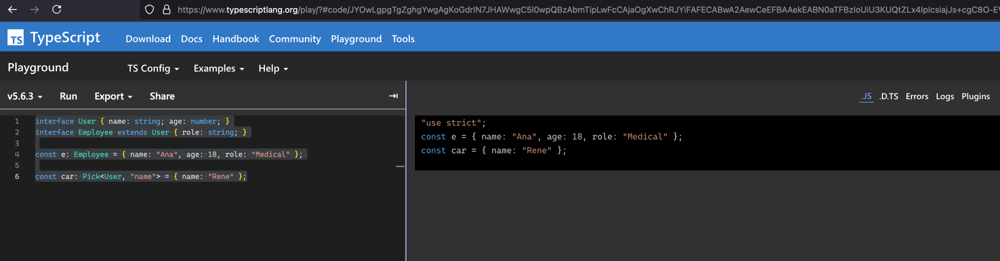
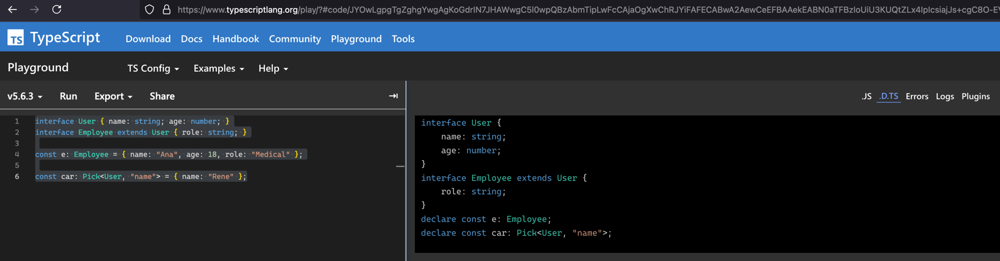
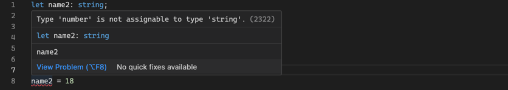
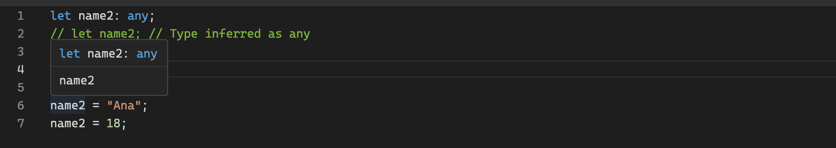
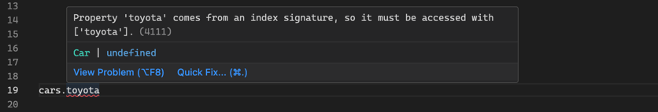
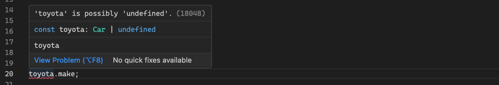

# JavaScript Tooling Guide

## Tooling Overview


### JavaScript Runtimes
- **Node**: A JavaScript runtime that allows you to run JavaScript outside the browser environment.
- **Deno**: A JavaScript/TypeScript runtime improving Node, focusing on security and developer experience.

### Package Managers
- **NPM**: A package manager for managing dependencies and packages in JavaScript projects.
- **PNPM**: A disk-space-efficient package manager that uses hard links and symlinks to save space.

### Languages, Compilers and Bundlers
- **TypeScript**: A statically typed superset of JavaScript providing type safety at compile time.
- **ESBuild**: A fast JavaScript and TypeScript compiler, bundler and minifier.

### Linters and Formatters
- **ESLint**: A tool for identifying and reporting on problematic patterns in JavaScript code, ensuring code quality.
- **Prettier**: An opinionated code formatter that enforces consistent code style across the codebase.

### Testing Frameworks
- **Jest**: A testing framework for writing unit and integration tests.
- **Playwright**: A testing framework that automates browsers for end-to-end testing.

### Build Tools
- **Vite**: A fast build tool for modern JavaScript projects with a built-in development server.


<br>
<hr>


## Node and NPM


### Overview
- **Link:** https://nodejs.org/en/
- **Purpose**: Node is a JavaScript runtime that allows you to run JavaScript outside the browser environment.
- **Developed By**: Ryan Dahl in 2009
- **JS Conf 2009**: [Ryan Dahl's Original Node.js Presentation](https://www.youtube.com/watch?v=ztspvPYybIY)

### Key Components
- **Node**: A JavaScript runtime that allows you to run JavaScript outside the browser environment.
- **NPM**: A package manager for managing dependencies and packages in JavaScript projects.
- **NPX**: A tool to execute Node packages without installing them globally, ideal for one-off command-line uses.

### Installation
* **Install:** https://nodejs.org/en/download
* **Update:** https://stackoverflow.com/questions/6237295/how-can-i-update-node-js-and-npm-to-their-latest-versions

```sh
# Check Node version
node -v

# Check NPM version
npm -v

# Check NPX version
npx -v
```

### Node Basic Commands
```sh
# Start a Node.js REPL
node

# Exit the REPL
Ctrl + C twice

# Run a JavaScript file
node <file_name>.js
```

### NPM Essentials
- **NPM Package**: A collection of JavaScript files that can be reused in different projects.
- **Package Manager**: A command line tool that finds, installs, and manages packages.
- **Package Registry**: A storage location where packages are published and installed from.
- **Scripts and Automation**: npm can run custom scripts for tasks like testing, building, and more, helping automate project workflows.
- **Dependency Management**: npm manages package versions and dependencies through `package.json` and `package-lock.json`.

### NPM Packages
- **Global vs. Local Packages**: Global packages are installed once and can be used across projects, while local packages are installed per project.
- **package.json**: A file that lists project dependencies, scripts, and metadata.
- **package-lock.json**: A file that locks down the exact versions of dependencies to ensure consistent installations.
- **node_modules**: A folder that contains all the installed packages for a project, managed by npm.


### NPM Basic Commands
```sh
# Creates a new project folder in Linux/Mac
mkdir <project-name>
cd <project-name>

# Initialize a new `npm project` (creates `package.json`)
npm init

# Installs a specific package (updates `package.json` and `node_modules`)
npm install <package_name>

# Update a package in `package.json`
npm update <package_name>

# Uninstall a package from `package.json`
npm uninstall <package_name>

# Install a package globally to use as a command line tool
npm install -g <package_name>

# Run a script from package.json
npm run <script_name>

# Upgrade npm to the latest version
npm install -g npm@latest
```


### NPM Demo Project
```sh
# Initialize npm
npm init

# Install Jest as a development dependency
npm install jest --save-dev

# Create a `src` and `test` folder
mkdir src
mkdir test

# Create `src/main.js`
console.log("Hello, World!");

# Create `test/main.test.js`
test('sample test', () => {
  expect(1 + 1).toBe(2);
});

# Run the project using npm scripts
npm run start
npm run test
```

### The `package.json` file
```json
{
  "name": "my-project",
  "version": "1.0.0",
  "description": "Demo Project",
  "type": "module",
  "main": "src/main.js",
  "scripts": {
    "start": "node src/main.js",
    "test": "jest"
  },
  "devDependencies": {
    "jest": "^27.0.6"
  }
}
```

- **`name`**: The name of your project. It must be unique if published.
- **`version`**: The current version of your project, following semantic versioning.
- **`description`**: A brief description of what your project does.
- **`main`**: The entry point of your application which is executed when running `node`.
- **`type`**: The module type, either `module` or `commonjs`. `import/export` is used for `module`.
- **`scripts`**: Defines a set of commands that can be run using `npm run`, such as starting the application or running tests.
- **`dependencies`**: Lists the packages required for your project to run. These are installed when running `npm install`.
- **`devDependencies`**: Lists the packages only needed during development (e.g., testing or building tools).


### The `node_modules` folder


- **Purpose**: Stores all the packages installed for the project.
- **Version Control**: Excluded from version control (in `.gitignore`) since it can be re-created with `npm install`.

### The `node_modules` folder issues 🤔


- **Nested Dependencies**: Each package can have its own dependencies, leading to a large number of files.
- **Transitive Dependencies**: Dependencies of dependencies can also be installed, leading to a large tree of packages.
- **Duplication**: The same package can be installed multiple times at different versions, leading to duplication.
- **Further Reading**: [Why is node_modules so big?](https://alphacoder.xyz/node-modules/)

<br>
<hr>


## `npm init`, `npm create`, and `npx`

### What Are They?
- **`npm init`** and **`npm create`** are commands for initializing new projects in Node.
- **`npm init`** is used both for creating a basic `package.json` file and for initializing projects from a template.
- **`npm create`** is an alias of `npm init`.

### How Do They Work?
- `npm init` or `npm create` without an initializer will to create a basic `package.json` file for your project. 
- `npm init` or `npm create` with an initializer (e.g., `react-app`), it prepends "create-" to the initializer name.
- Internally it is transformed to `npm exec create-<initializer>` (e.g. `npm exec create-react-app`).
- Additionally, npm **downloads** the initializer package (e.g., `create-react-app`) if it's not already downloaded and then **executes** the corresponding binary.
- `npx create` with an initializer **temporarily downloads** the package and then **executes** it, similar to npm create.

### Examples
- **Basic Initialization**
```sh
# Create a new plain npm project with a basic `package.json` file.
npm init
npm create
  ```
- **Create a Project Using a Template**
```sh
# Create a new project using a template.
npm init <initializer>
npm create <initializer>
npx create-<initializer>

# Create a new React project using `create-react-app` template.
# Requires the package `create-react-app` to be either installed globally or will install it permanently.
npm init react-app my-app
npm create react-app my-app

# Does not require a global install; installs the package temporarily for this use.
npx create-react-app my-app
```


### Overview

| Command                     | What It Does                                      | Internal Transformation                    |
|-----------------------------|---------------------------------------------------|--------------------------------------------|
| `npm init`                  | Initializes a new project (e.g., `package.json`). | No transformation.                         |
| `npm create`                | Alias of `npm init`, initializes a project.       | No transformation.                         |
| `npm init <initializer>`    | Creates a new project using a template.           | Turns into `npm exec create-<initializer>` |
| `npm create <initializer>`  | Same as `npm init <initializer>`.                 | Turns into `npm exec create-<initializer>` |
| `npx create-<initializer>`  | Runs a package directly without global install.   | Direct execution, no transformation.       |


<br>
<hr>

## Semantic Versioning


### Overview
- **Link:** https://semver.org/
- **Purpose**: Semantic versioning is a versioning scheme that helps manage project dependencies.
- **Format**: Versions are in the format `MAJOR.MINOR.PATCH` (e.g., `1.2.3`).

### Versioning Scheme

- **MAJOR (Breaking)**: Indicates breaking changes that are not backward compatible.
- **MINOR (Feature)**: Introduces new features that are backward compatible.
- **PATCH (Fix)**: Implements bug fixes that are backward compatible.
- **Label**: Additional labels like `alpha`, `beta`, or `rc` can be added for pre-release versions.
- **Example**: `1.2.3-rc.1` indicates version `1.2.3` release candidate 1.

### Versioning Operators

- **Exact Version:** Only version `27.0.6` is installed.
  ```sh
  "jest": "27.0.6"
  ```

- **Tilde (`~`)**: Updates to patch versions only.
  ```sh
  "jest": "~27.0.6"
  ```


- **Caret (`^`)**: Updates to minor and patch versions.
  ```sh
  "jest": "^27.0.6"
  ```

### Versioning Best Practices

- **Caret (^) for Libraries**: Use `^` for libraries to get new features and bug fixes.
- **Tilde (~) for Apps**: Use `~` for applications to get bug fixes but avoid new features.
- **Lockfile**: Use `package-lock.json` to ensure consistent installations across environments.
- **Update Regularly**: Update packages regularly to get security patches and new features.
- **Automated Testing**: Run tests after updating to catch any breaking changes early.
- **Audit**: Use `npm audit` to check for vulnerabilities in your dependencies.


### Updating Packages
- **Update all packages**: `npm update` updates all packages to their latest versions based on the versioning scheme.
- **Update a single package**: `npm update <package_name>` updates a specific package to its latest version based on the versioning scheme.


<br>
<hr>


## Typescript Demo Project

- This project demonstrates setting up a TypeScript project with ESBuild, ESLint, Prettier, and Jest.

### Project Setup
```sh
# Create a new project folder
mkdir my-typescript-project
cd my-typescript-project

# Initialize a new npm project
npm init

# Install Typescript locally in the project
npm install --save-dev typescript

# Initialize Typescript configuration (creates `tsconfig.json`)
npx tsc --init

# Create `src` and `test` folders
mkdir src
mkdir test
```

### Project Structure

```markdown
my-project/
├── node_modules/               # Dependencies
│   └── ...
├── dist/                       # Compiled output from ESBuild
│   └── ...
├── src/                        # Sources
│   ├── main.ts                 # Main Entry Point
│   └── ...
├── test/                      # Tests
│   ├── main.test.ts            # Main Entry Point Jest Test
│   └── ...
├── package.json                # Project Config and Dependencies
├── tsconfig.json               # TypeScript Config
├── eslint.config.js            # ESLint Config
├── prettier.config.js          # Prettier Config
├── jest.config.js              # Jest Config
├── .gitignore                  # Git Ignore
└── README.md                   # Project Documentation
```


### Typescript Configuration (`tsconfig.json`)
- **Link**: https://www.typescriptlang.org/tsconfig

```json
{
  "compilerOptions": {
    "target": "ES2020",                         // ECMAScript version for output (target JS version to use)
    "module": "ESNext",                         // Module system for output (e.g., ES Modules)
    "lib": ["ES2020", "DOM", "DOM.Iterable"],   // List of libraries to include (e.g., built-in JS features for ES2020)
    // "lib": ["ES2020"],                       // List of libraries for non-browser based projects (e.g., Node)

    /* Output and Root Directories */
    "outDir": "./dist",                         // Directory to place output files after compilation
    "rootDir": "./src",                         // Directory containing primary source files

    /* Linting and Type Safety */
    "strict": true,                             // Enable all strict type-checking options
    "noUnusedLocals": true,                     // Report errors on unused variables
    "noUnusedParameters": true,                 // Report errors on unused parameters
    "noImplicitReturns": true,                  // Report errors on missing return statements
    "noImplicitAny": true,                      // Report errors on implicit any types
    "noImplicitThis": true,                     // Report errors on this expressions with an implied any type
    "noPropertyAccessFromIndexSignature": true, // Report errors on property access from an index signature
    "noUncheckedIndexedAccess": true,           // Report errors on unchecked indexed access
    "noFallthroughCasesInSwitch": true,         // Report errors on fallthrough cases in switch statements
    "noUncheckedSideEffectImports": true,       // Report errors on imports with side effects

    /* Paths and Module Aliases */
    "paths": {}                                 // Path aliases for imports
  },
  "include": ["src/**/*"],                      // Include primary source files for compilation
  "exclude": ["node_modules"]                   // Exclude node_modules from compilation
}
```


### Initial `package.json`
```json
{
  "name": "my-typescript-project",
  "version": "1.0.0",
  "description": "Typescript Demo Project",
  "type": "module",
  "main": "dist/main.js",
  "scripts": {
    "build": "tsc",
    "start": "npm run build && node dist/main.js"
  },
  "devDependencies": {
    "typescript": "^5.6.3"
  }
}
```


### Example Code
```javascript
// src/utils.ts
export function greet(name) {
  console.log(`Hello, ${name}!`);
}

// src/main.ts
import { greet } from './utils.js'; 
greet("World");
```

### Run Scripts
```sh
# run: Run TypeScript compiler to compile the project into JavaScript (slow for large projects)
npm run build

# start: Build and run the JavaScript main.js file in the dist folder
npm run start
```


<br>
<hr>


## TypeScript Language


### Overview
* **Link**: https://www.typescriptlang.org/
* **Purpose**: A statically typed superset of JavaScript providing type safety at compile time.
* **Developed By**: Microsoft


### Key Features
* **Type Safety**: Catches errors during development through static type checking.
* **Type Inference**: Automatically determines types when they're not explicitly specified.
* **JavaScript Compatibility**: All valid JavaScript code is valid TypeScript code.
* 

### Playground

- **Purpose**: An online editor to experiment with TypeScript code and see the JavaScript output.
- **Link**: https://www.typescriptlang.org/play


- The **.js** view shows the JavaScript output of the TypeScript code.


  
- The **.d.ts** view provides a type-only, showing declarations of interfaces, types, and constants without implementation details.


  
### Basic Types
- TypeScript provides several basic types to represent data.
```typescript
const isDone: boolean = false;
const count: number = 42;
const name: string = "Rene";
const list: number[] = [1, 2, 3];
const tuple: [string, number] = ["hello", 10];
```

### Type Inferencing
- TypeScript automatically infers types based on the assigned values.
```typescript
const isDone = false; // Type inferred as boolean
const count = 18; // Type inferred as number
const name = "Ana"; // Type inferred as string
```

### Type Errors
- TypeScript catches type errors during compilation, hence preventing runtime errors.
```typescript
let name = "Ana"
name = 42; // ❌ Error: Type 'number' is not assignable to type 'string'.
```

  

### Any Type
- Using `any` is discouraged because it opts out of type checking and leads to unsafe code that breaks at runtime.
```typescript
let name2: any;
// let name2; // Type inferred as any

name2 = "Ana";
name2 = 18;
```

  

### Object Types
- Defines the shape of an object.
```typescript
interface User { name: string; age: number; }
type User = { name: string; age: number; }
```

### Object Types Extended
- Extending object types allows to build on existing object types.
```typescript
interface Employee extends User { role: string; }
type Employee = User & { role: string; }
```

### Declaration Merging
- Allows adding properties to an existing interface. Useful for extending third-party libraries or global objects.
```typescript
interface Document { customProperty: string; }
document.customProperty = "My Custom Property";
```

### Array Types
- An array type can be written in two ways.
```typescript
let numbers: number[] = [1, 2, 3];
let numbers: Array<number> = [1, 2, 3];
```

### Function Types
- Defines the parameters and return type of function.
```typescript
function greet(user: User): string {
    return `Hello, ${user.name}!`;
}
```

### Declare Keyword
- Used to declare the type information for functions, variables, or classes without providing their implementation.
- Without both the type definition and implementation must be provided in the same file.
```typescript
// e.g., my-custom-library.d.ts
declare function greet(name: string): void;
declare let age: number;

// e.g., my-custom-library.js
function greet(name: string): void { /*..*/ }
let age: number = 18;
```


### Function Overloading
- Allows defining multiple function signatures for a single function.
```typescript
// my-custom-library.d.ts
declare function add(a: number, b: number): number;
declare function add(a: string, b: string): string;

// my-custom-library.js
function add(a: any, b: any): any { /*..*/ }
```


### Generic Types
- A type that can work with multiple data types.
```typescript
function map<T, U>(array: T[], mapFn: (elem: T) => U): U[] {
    return array.map(mapFn);
}

const numbers = map([1, 2, 3], (x) => x * 2);
const strings = map(["a", "b", "c"], (x) => x.toUpperCase());
```

### Enum Types
- **Auto-assigned Values**: Enum values are auto-assigned starting from 0.
```typescript
enum Color { Red, Green, Blue }

const myColor = Color.Red;
if (myColor === Color.Green) { /*..*/ }
```

- **Custom Values**: Enum values can be assigned custom values.
```typescript
enum Direction { Up = 1, Down = 2, Left = 3, Right = 4 }

const myMove = Direction.Up;
if (myMove === Direction.Down) { /*..*/ }
```

### Aliase Types
- Creates a new name for an existing type.
```typescript
type Name = string;
type NameResolver = () => string;

const myName: Name = "Alice";
```

### Literal Types
- A type that represents a single value.
```typescript
type Direction = "left" | "right" | "up" | "down";

function move(direction: Direction) {
    console.log(`Moving ${direction}`);
}
```

### Union Types (A ∪ B)
- **A | B**: A type that can be one of several types.
```typescript
type StringOrNumber = string | number;

function printId(id: StringOrNumber) {
    console.log(`Id: ${id}`);
}
```

### Union Types (A ∪ B) with a Discriminant Property
- **A | B**: A type that can be one of several types with a common property.
```typescript
interface Square { kind: "square"; size: number; }
interface Rectangle { kind: "rectangle"; width: number; height: number; }
type Shape = Square | Rectangle;

function getArea(shape: Shape): number {
    switch (shape.kind) {
        case "square":
            return shape.size * shape.size;
        case "rectangle":
            return shape.width * shape.height;
        // Potential error if new shape is added
    }
}
```

### Intersection Types (A ∩ B)
- **A & B**: A type that combines multiple types.
```typescript
interface HasName { name: string; }
interface HasAge { age: number; }
type Person = HasName & HasAge;

function printPerson(person: Person) {
    console.log(`Name: ${person.name}, Age: ${person.age}`);
}
```

### Interface vs. Type - Which One to Use?
- **interface**: Use when defining object shapes, especially when extending.
- **type**: Use when unions, intersections, alias, or more complex type combinations are needed.
```typescript
// Interface for object shapes
interface Animal { name: string; }
interface Dog extends Animal { breed: string;}

// type for complex types
type ID = string | number;

// type for aliases
type CryptoKey = string;
```


### Type Guards
- **is**: TypeGuards are runtime checks that determine if a value is of a specific type.
```typescript
function isNumber(value: unknown): value is number {
  return typeof value === "number";
}

function doubleValue(value: number | string) {
  if (isNumber(value)) {
    return value * 2;
  } else {
    return value + value;
  }
}

doubleValue(5); // 10
doubleValue("Hi"); // "HiHi"
```


### Type Assertions
- **Subtype Relationship (S is a subtype of T):** Works and is type-safe.
```typescript 
interface Animal { name: string; }
interface Dog extends Animal { breed: string;}

let myDog: Dog = { name: "Rex", breed: "Labrador" };
let animal: Animal = myDog as Animal;
```

- **Supertype Relationship (T is a supertype of S):** Works, but it's not guaranteed to be safe.
```typescript
let animal2: Animal = { name: "Max" };
let myDog2 = animal2 as Dog;
```

- **Structural Compatibility:** TypeScript checks the structure of the types, not the names.
```typescript
interface Car { make: string; model: string; }
interface Vehicle { make: string; model: string; wheels?: number; }

let myCar: Car = { make: "Toyota", model: "Corolla" };
let vehicle: Vehicle = myCar as Vehicle;
```

- **Unrelated Types**: Double assertion `..as unknown as` allows for any type conversion.
```typescript
function handler(event: Event) {
    // Neither 'Event' nor 'HTMLElement' is assignable to the other
    let element = event as unknown as HTMLElement;
}
```

### Special Types
- **Never**: A type for functions that never return.
```typescript
function throwError(message: string): never {
    throw new Error(message);
}
```

- **Void**: A type for functions that don't return a value.
```typescript
function logError(message: string): void {
    console.error(message);
}
```

- **Any**: A type to opt out of type checking, giving complete flexibility but losing type safety.
```typescript
let value: any;
value = 42;

// This will compile but can cause runtime errors if `value` is not a string.
console.log(value.toUpperCase());
```

- **Unknown**: A type-safe counterpart to `any` that forces type-checking before usage.
```typescript
let value: unknown;
value = "Hello, World!";

// This will not compile without a type assertion or type guard.
if (typeof value === "string") {
    console.log(value.toUpperCase());
}
```


### Utility Types

```typescript
interface Car { make: string; model: string; year?: number; }
```

- **Partial<Type>**: Create a new type by making all properties optional (opposite of `Required`).
```typescript
function updateCar(car: Car, partialCar: Partial<Car>): Car {
    return { ...car, ...partialCar };
}
```

- **Pick<Type, Keys>**: Create a new type by selecting properties from an existing object type. (opposite of `Omit`)
```typescript
const car: Pick<Car, "make" | "model"> = { make: "Toyota", model: "Corolla" };

car.make = "Honda"; // OK
car.model = "Civic"; // OK
car.year; // Error
```

- **Omit<Type, Keys>**: Create a new type by excluding properties from an existing object type. (opposite of `Pick`)
```typescript
const car: Omit<Car, "year"> = { make: "Toyota", model: "Corolla" };

car.make = "Honda"; // OK
car.model = "Civic"; // OK
car.year; // Error
```

- **Record<Keys, Type>**: Create a new dictionary type with specified keys and value types.

```typescript
const cars: Record<string, Car> = {
    "toyota": { make: "Toyota", model: "Corolla", year: 2020 },
    "honda": { make: "Honda", model: "Civic", year: 2021 }
};
```

- **noPropertyAccessFromIndexSignature** raises an error if using dot notation to access dynamic properties.
  

```typescript
// ❌ Error: if `noPropertyAccessFromIndexSignature` is true (set in tsconfig.json)
const toyota = cars.toyota;

// ✅ OK: Use bracket notation to access dynamic properties
const toyota = cars["toyota"];
toyota.make = "blabla";
```

- **noUncheckedIndexedAccess** raises an error if access dynamic properties without handling if the property is undefined.
  
```typescript

// ❌ Error: if `noUncheckedIndexedAccess` is true (set in tsconfig.json)
toyota.make = "blabla";

// ✅ OK: Check if dynamic property exists
const toyota = cars["toyota"];
if (toyota) { toyota.make = "blabla"; }

// ✅ OK: Use non-null assertion operator, only if you are sure that the property exists
const toyota = cars["toyota"]!;
toyota.make = "blabla";
```


### Non-Null Assertation Operator
- **!**: Non-Null Assertion (!) tells TypeScript to ignore potential null or undefined values.

```typescript
const toyota = cars["toyota"]!;
toyota.make = "blabla";
```


### Generic Constraints
- **extends**: Creates a type of all the properties defined in the interface, plus additional properties.
```typescript
function logCar<T extends Car>(car: T) {
    console.log(car.make.length);
}

// ✅ OK: all required properties
logCar({ make: "Toyota", model: "Corolla" });

// ✅ OK: all required plus extra properties
logCar({ make: "Tesla", model: "Model X", autopilot: true });

// ❌ Error: Object literal may only specify known properties.
logCar({ cool: true }); 
```

### Lookup Types
- **keyof**: Create a union type by extracting keys from an object type.
```typescript
// CarKeys = "make" | "model" | "year"
type CarKeys = keyof Car; 

// CarPropTypes = string | number
type CarPropTypes = Car[keyof Car];
```

### Lookup Types & Generic Constraints
- **extends keof**: Constrain a generic type to keys of an object type.
```typescript
// Key extends keyof Car = dynamic type based on Car keys
function getCarProperty<Key extends keyof Car>(car: Car, key: Key): Car[Key] {
    return car[key];
}

// T extends keyof Type = dynamic type based on T keys
function getProperty<Key extends keyof T, T>(obj: T, key: Key): T[Key] {
    return obj[key];
}
```

### Mapped Types
- **in**: Create a object type by mapping over the properties of an existing type.
```typescript
// Make all properties optional
type OptionalCar = {
  [K in keyof Car]?: Car[K];
};

// Make all properties readonly
type ReadOnlyCar = {
  readonly [K in keyof Car]: Car[K];
};
```

### Type Queries

- **typeof**: Extract the type of a variable or property.
```typescript
const prop = "make";

// CarMakeType = "string"
type CarMakeType = typeof prop;

// CarMakeType = "string"
type CarMakeType = Car["make"];

// CarMakeType = dynamic type based on prop
type CarMakeType = Car[typeof prop];
```

### Type Access Patterns Overview

| Syntax                      | Description                                      | Example Type Inference                      |
|-----------------------------|--------------------------------------------------|---------------------------------------------|
| `type T = Car["make"]`      | Get type of `"make"`                             | `string`                                    |
| `type T = typeof prop`      | Get type of the value `prop`                     | Based on `prop`                             |
| `type T = Car[typeof prop]` | Get type of the value the Car property `prop`    | Based on `prop`                             |
| `type T = keyof Car`        | Get all keys of `Car` as a union                 | `"make" \| "model" \| "year"`               |
| `type T = Car[keyof Car]`   | Get all value types of `Car` as a union          | `string \| number \| undefined`             |
| `<T extends keyof Car>`     | Constrain `T` to keys of `Car`                   | Flexible, depends on `Car`                  |
| `prop: T, value: Car[T]`    | Use `T` for both the key and value type in `Car` | Depends on `T`, e.g., `string` for `"make"` |

### Guarding Angel of Exhaustive Trick: `assertNever(value: never): never`


- **Purpose**: When working with discriminated unions, TypeScript can help ensure all cases are handled.
- **Use**: The `assertNever` function to ensure all cases are handled, preventing runtime errors.

```typescript
interface Square { kind: "square"; size: number; }
interface Rectangle { kind: "rectangle"; width: number; height: number; }
type Shape = Square | Rectangle;

function assertNever(value: never): never {
    throw new Error("Unexpected value received: " + value);
}

function getArea(shape: Shape): number {
    switch (shape.kind) {
        case "square":
            return shape.size * shape.size;
        case "rectangle":
            return shape.width * shape.height;
        default:
            return assertNever(shape); 
    }
}
```


### Double Assertion Trick: `..as unknown as..`


- **Purpose**: Double assertion allows for type conversions that TypeScript might otherwise prevent due to type safety.  
 Typescript uses `as unknown as` to assert a value through `unknown` (or `any`) to a target type.

```typescript
function handleEvent(event: Event) {
    // Okay: The `event` is a `MouseEvent`, so we can solve it with single assertion
    let mouseEvent = event as MouseEvent;
}

function handler(event: Event) {
    // Error: Neither 'Event' nor 'HTMLElement' is assignable to the other, so we need double assertion
    // let element = event as HTMLElement;
    
    // Okay: Double assertion allows for type conversion
    let element = event as unknown as HTMLElement;
}
```
- **Single Assertion Rules**: TypeScript allows a type assertion `S as T` if either `S` is a subtype of `T` or `T` is a subtype of `S`.
- **Double Assertion Rules**: When single assertion is not allowed use `as unknown as` to bypass TypeScript's checks.
- **Use `unknown` vs `any`**: Both `as unknown as` and `as any as` can be used, but `unknown` is preferred for type safety.


### Definite Assignment Assertion Trick: `variable!: type`


- **Purpose**: Is used to tell TypeScript that a variable will be **assigned** before it is accessed, even if TypeScript's cannot prove this.
- **Use `!`**: To declare a variable that will be initialized later, especially in situations involving conditional logic or initialization in a separate function.

```typescript
// No initialization
let userName!: string;

// Delayed initialization
initializeUser();
console.log(userName.toUpperCase());

// Initialize of the variable
function initializeUser() {
    userName = "Alice";
}
```


### Path Aliases `(tsconfig.json)`

- **Link**: [Path Aliases in TypeScript](https://www.typescriptlang.org/tsconfig#paths)
- **Purpose**: Path aliases provide cleaner, descriptive import paths, making code easier to read, maintain, and refactor.
- **Note**: Path aliases must be resolved by module bundlers like ESBuild since JavaScript does not support this natively.


- **Example Configuration**
```json
{
  "compilerOptions": {
    "paths": {
      "@components/*": ["components/*"],
      "@models/*": ["models/*"],
      "@utils/*": ["utils/*"]
    }
  }
}
```

- **Example Usage**
```typescript
// Before
import { User } from "../../models/user";
import { formatDate } from "../../utils/date";
import { Button } from "../../components/button";

// After
import { User } from "@models/user";
import { formatDate } from "@utils/date";
import { Button } from "@components/button";
```


### Type Definitions (`*.d.ts`)
- **Link**: https://www.typescriptlang.org/docs/handbook/2/type-declarations.html
- **Purpose**: Type definitions provide type information for JavaScript libraries without TypeScript support.
- **Installation**: Type definitions are installed via `@types` packages.
- **Example**: `npm install --save-dev @types/react` installs type definitions for React.


<br>
<hr>


## ESBuild


### Overview
- **Link**: https://esbuild.github.io/
- **Purpose**: A fast JavaScript and TypeScript compiler, bundler, and minifier.
- **Developed By**: Evan Wallace and open-source contributors.


### Key Features
- **Speed**: Written in Go, ESBuild is significantly faster compared to traditional JavaScript bundlers and the TypeScript compiler `tsc`.
- **JavaScript Bundling**: Built-in support for JavaScript, TypeScript, JSX, and ESM/CommonJS modules.
- **CSS Bundling**: Supports bundling of CSS, including CSS modules, which makes managing styles in large applications more efficient.
- **Minifier**: Performs code minification to reduce bundle size, enabling better load performance for production deployments.

### Installation

```sh
# Install ESBuild locally in the project
npm install --save-dev esbuild
```

### Update `package.json`
```json
{
  // ..
  "main": "dist/bundle.js",
  "scripts": {
    "type-check": "tsc --noEmit",
    "build": "esbuild src/main.ts --bundle --minify --outfile=dist/bundle.js",
    "start": "npm run build && node dist/bundle.js"
  },
  // ..
}

```

### Configuration
- **Link**: https://esbuild.github.io/getting-started/#build-scripts


### Run Scripts
```sh
# type-check: Run TypeScript compiler for type checking, but don't emit any files (slow for large projects)
npm run type-check

# build: Run ESBuild to transpile Typescript to JavaScript (fast for large projects)
npm run build
```


<br>
<hr>


## ESLint


### Overview
* **Link**: https://eslint.org/
* **Purpose**: A tool for identifying and reporting on problematic patterns in JavaScript code, ensuring code quality.
* **Developed By**: Nicholas C. Zakas and open-source contributors.

### Key Features

- **Static Code Analysis**: ESLint performs static code analysis, identifying problematic patterns and potential errors in your code.
- **Customizable**: Allows you to customize rules to match your project's coding standards and best practices.
- **Supports**: Works with JavaScript, TypeScript, JSX, and can be extended with plugins.
- **Integration**: Works seamlessly with popular editors like VS Code, IntelliJ, and can be used with Git hooks.


### Installation

```sh
# Install ESLint locally in the project
npm install --save-dev eslint

# Initialize ESLint configuration (creates `eslint.config.js`)
npx eslint --init
```

### Update `package.json`
```json
{
  "scripts": {
    // ..
    "lint": "eslint \"{src,test}/**/*.ts\" --fix",
  },
}
```


### Configuration (`eslint.config.js`)
- **Link**: https://eslint.org/docs/latest/use/configure/configuration-files#configuration-objects

```javascript
import globals from "globals";
import pluginJs from "@eslint/js";
import tseslint from "typescript-eslint";

/** @type {import('eslint').Linter.Config[]} */
export default [
  {files: ["**/*.{js,mjs,cjs,ts}"]},
  {languageOptions: { globals: globals.browser }},
  pluginJs.configs.recommended,         // JavaScript recommended rules
  ...tseslint.configs.recommended,      // TypeScript recommended rules

  // Add custom linting rules here
  {
    rules: {
      "semi": ["error", "always"],      // Enforce semicolons
      "quotes": ["error", "single"],    // Enforce single quotes
      "prefer-template": ["error"]      // Enforce using template literals
    },
  },
];
```


### Run Scripts
```sh
# lint: Run ESLint to identify and fix linting issues in TypeScript files
npm run lint
```


<br>
<hr>


## Prettier


### Overview
* **Link**: https://prettier.io/
* **Purpose**: An opinionated code formatter that enforces consistent style across projects.
* **Developed By**: James Long and contributors.

### Key Features
- **Consistent Code Style**: Ensures that all code in a project looks the same, reducing code review churn.
- **Supports**: Works with JavaScript, TypeScript, CSS, HTML, JSON, and more.
- **Integration**: Works seamlessly with popular editors like VS Code, IntelliJ, and can be used with Git hooks.

### Installation

```sh
# Install Prettier locally in the project
npm install --save-dev prettier
```

### Update `package.json`
```json
{
  "scripts": {
    // ..
    "format": "prettier --write \"{src,test}/**/*.ts\"",
  },
}
```

### Configuration (`prettier.config.js`)
- **Link**: https://prettier.io/docs/en/configuration.html

```javascript
/** @type {import("prettier").Config} */
export default {
  trailingComma: "all",   // Comma at the end of the line
  tabWidth: 2,            // 2 spaces for indentation
  semi: true,             // Enforce semicolons
  singleQuote: true,      // Single quotes for strings
};
```

### Run Scripts
```sh
# format: Run Prettier to format TypeScript files
npm run format
```

<br>
<hr>


## Jest


### Overview

- **Link**: https://jestjs.io/
- **Purpose**: A delightful JavaScript testing framework with a focus on simplicity.
- **Developed By**: Facebook and open-source contributors.

### Key Features

- **Zero Configuration**: Works out of the box for most JavaScript projects with minimal configuration required.
- **Unit Testing**: Provides a simple and easy-to-use API for writing unit tests.
- **Snapshot Testing**: Allows you to take a snapshot of your components and test whether they remain the same over time.
- **Built-in Matchers**: Includes built-in matchers for common assertions like `toBe`, `toEqual`, and `toMatch`.
- **Code Coverage**: Automatically collects code coverage to see how well your tests are covering the codebase.


### Installation
```sh
# Install Jest locally to the project with TypeScript support
npm install --save-dev jest @types/jest ts-jest

# # Initialize Jest configuration (creates `jest.config.js`)
npx ts-jest config:init
```

### Update `package.json`
```json
{
  "scripts": {
    // ..
    "test": "jest",
  },
}
```

### Configuration (`jest.config.js`)
- **Link**: https://jestjs.io/docs/configuration

```javascript
/** @type {import('ts-jest').JestConfigWithTsJest} **/
export default {
  preset: 'ts-jest',            // Typescript support
  testEnvironment: "node",      // Environment for running tests
  roots: ['<rootDir>/test'],    // Directories to search for tests
};
```

### Run Scripts
```sh
# test: Run Jest to execute tests in the `test` directory
npm run test
```

### Writing Tests

```typescript
// src/add.ts
export function add (a: number, b: number): number {
  if (a < 0 || b < 0) { throw new Error("Numbers must be positive"); }
  return a + b;
}
```

```typescript
// test/add.test.ts
import { add } from '../src/add.js';

describe('add function', () => {
  it('should return the correct sum of two positive numbers', () => {
    expect(add(2, 3)).toBe(5);
  });

  it('should throw an error for negative numbers', () => {
    expect(() => add(-2, 3)).toThrow("Numbers must be positive");
  });
});
```

### Explanation 
- **`describe`**: Groups related tests. In this case, it groups tests for the `add` function.
- **`it`**: Defines individual test cases. Each `it` block describes a specific scenario to test.
- **`expect`**: This is the assertion that checks if the actual output (`result`) matches the expected output (`toBe(5)`, etc.).


<br>
<hr>